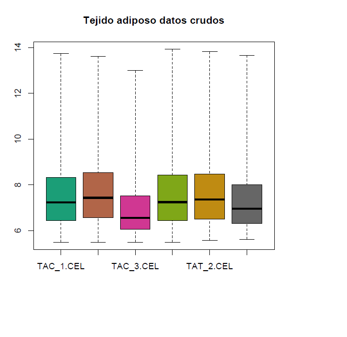

## Tercer avance del proyecto final
                                                  *Miguel Angel Espinoza Camacho*
# Propuesta del proyecto. 

La propuesta para el trabajo final del curso es la de analizar datos propios obtenidos de microarreglos de expresión. Los datos son parte del trabajo de investigación del posgrado, el cual lo realiza en el Instituto nacional de medicina genómica. En concreto, el presente trabajo tendrá como objetivo analizar el efecto  agudo de la sobrenutrición en el transcriptoma del tejido adiposo de rata wistar (Rattus norvergicus).

# Efecto de la sobrenutrición temprana a corto plazo sobre el transcriptoma del tejido adiposo

## Introdución

La sobrenutrición es definida como un exceso en el consumo de alimento que sobre pasa el requerimiento energético del metabolismo de un organismo. Actualmente algunas enfermedades crónico-degenerativas no transmisibles como la obesidad, hipertensión, dislipídemia y diabetes mellitus tipo 2 se encuentran asociadas a la sobrenutrición. Además, las comorbilidades de estas enfermedades disminuyen la calidad de vida y relacionan con un aumento en la mortalidad en la población mexicana. El gasto en el sector salud derivados de estas enfermedades metabólicas se incrementa a medida que aumenta la tasa de prevalencia e incidencia de estas enfermedades(1).

Mientras que el tejido adiposo presenta diferentes funciones esenciales y actualmente se considera como un órgano endócrino. El tejido adiposo principalmente mantiene integridad mecánica, almacenamiento de lípidos, termogénesis, respuesta inmunitaria, lipólisis, apetito, saciedad y sensibilidad a la insulina. Los procesos antes mencionados se mantienen debido a la función sincrónica de diferentes tipos celulares como adipocitos, fibroblastos, células mesenquimales y células del sistema inmune (linfocitos, granulocitos, macrófagos y células dendríticas). En la adiposopatía existe un desequilibrio en el tipo y número de células inmunitarias que genera una inflamación de bajo grado local y sistémica. Los adipocitos cambian de morfología, se vuelven hiperplásicos e hipertróficos, y en consecuencia aumenta la tasa de necrosis y apoptosis generada por el microambiente inflamatorio y lipotóxico (3,4).

## El objetivo 

El presente trabajo es analizar el efecto a corto plazo de la sobrenutrición temprana en el transcriptoma del tejido adiposo en rata Wistar.

## Materiales y métodos 

La metodología con la que se evaluará el transcriptoma consiste en la hibridación de microarreglos de expresión, en este caso se utilizó el chip Raragen 2.0 ST de Affymetrix. Este chip evalúa 28,407 transcritos de los cuales, ~22,000 son codificantes para proteínas. Cabe mencionar que en este trabajo es de interés generar un análisis de transcriptoma por contraste para determinar la expresión relativa.

### Análisis bioinformático

[SCRIPT_WROKFLOW](https://github.com/mike9999999/ProyectoFinalBioinf2018-II/blob/master/script_avance%203.R)

## Resultados Parciales
Distribución de datos crudos

## Cronograma

**26 abril:** 

Entrega de segundo reporte que contiene el desarrollo central del proyecto con anotaciones puntuales. 

Realizar los análisis correspondientes a calidad y normalización así como de contrastes estadísticos.

Desarrollos de las redes de interacción metabólica.

Termino del proyecto

**17 de mayo: entrega final**

## Referencias

1.	Martin KA, Mani MV, Mani A. New targets to treat obesity and the metabolic syndrome. European journal of pharmacology. 2015;763(Pt A):64-74.
2.	Argente-Arizon P, Diaz F, Ros P, Barrios V, Tena-Sempere M, Garcia-Segura LM, Argente J, Chowen JA. The Hypothalamic Inflammatory/Gliosis Response to Neonatal Overnutrition Is Sex and Age Dependent. Endocrinology. 2018;159(1):368-387.
3.	Kim KS, Seeley RJ, Sandoval DA. Signalling from the periphery to the brain that regulates energy homeostasis. Nature reviews Neuroscience. 2018.
4.	Louwen F, Ritter A, Kreis NN, Yuan J. Insight into the development of obesity: functional alterations of adipose-derived mesenchymal stem cells. Obesity reviews : an official journal of the International Association for the Study of Obesity. 2018.
5.	Yim HE, Yoo KH, Bae IS, Hong YS, Lee JW. Postnatal early overnutrition causes long-term renal decline in aging male rats. Pediatric research. 2014;75(2):259-265.
6.	Pallares J, Santacana M, Puente S, Lopez S, Yeramian A, Eritja N, Sorolla A, Llobet D, Dolcet X, Matias-Guiu X. A review of the applications of tissue microarray technology in understanding the molecular features of endometrial carcinoma. Analytical and quantitative cytology and histology. 2009;31(4):217-226.

